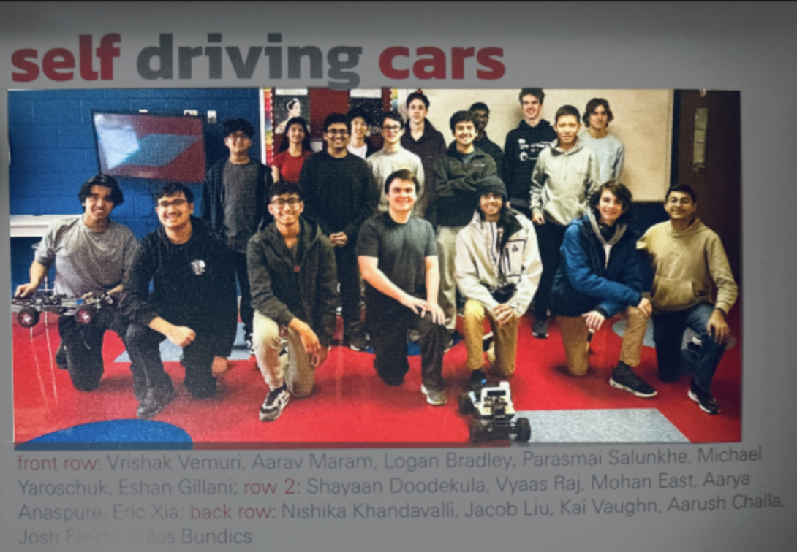
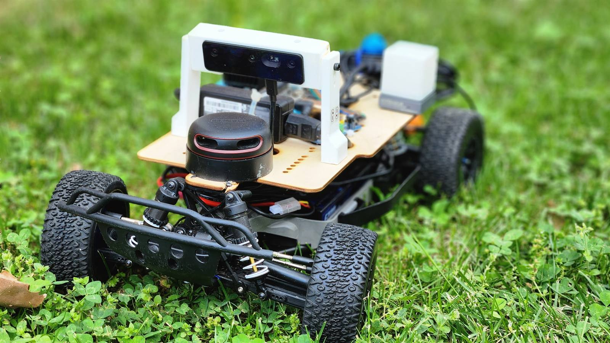

# About Atlas Autoware

Atlas Autoware is a nonprofit organization run by high school students in Northern Virginia. We design, build, and test autonomous vehicles competing in international robotics competitions. Every component, from sensors to software, is engineered by our team members.

## Donate?

Contact us at contact@atlasautoware.org to help us out.

<table>
<tr>
<td width="50%"></td>
<td width="50%"></td>
</tr>
</table>

---

**Built by Atlas Autoware students**

